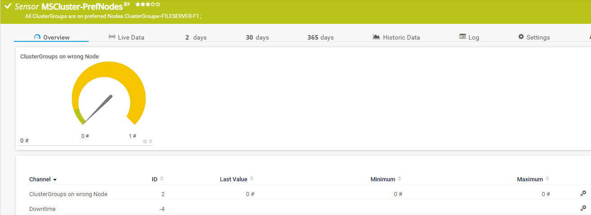
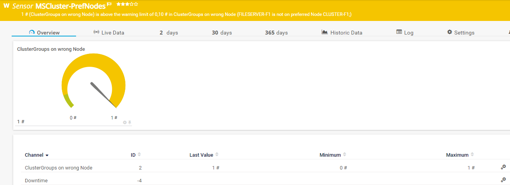

# PRTG-MSCluster-PrefNodes
# About

## Project Owner:

Jannos-443

## Project Details

Checks if Windows Cluster Roles are on preferred Node(s)

## HOW TO

1. Place "PRTG-MSCluster-PrefNodes.ps1" under "C:\Program Files (x86)\PRTG Network Monitor\Custom Sensors\EXEXML"

2. Create Sensor and set "Use Windows credentials of parent device" 

4. Set the "$IgnorePattern" or "$IgnoreScript" parameter to Exclude ClusterGroups

5. If you want the Sensor to return Error and not Warning change the Channel Limit.


## Examples



ClusterGroup exceptions
------------------
You can either use the **parameter $IgnorePattern** to exclude a ClusterGroup on sensor basis, or set the **variable $IgnoreScript** within the script. Both variables take a regular expression as input to provide maximum flexibility. These regexes are then evaluated againt the **VM Name**

By default, the $IgnoreScript varialbe looks like this:

```powershell
$IgnoreScript = '^(Verfügbarer Speicher|Clustergruppe)$'
```

For more information about regular expressions in PowerShell, visit [Microsoft Docs](https://docs.microsoft.com/en-us/powershell/module/microsoft.powershell.core/about/about_regular_expressions).

".+" is one or more charakters
".*" is zero or more charakters
